<!-- 👋 Hi there, I'm Allen Umali -->
#  Hi there, I'm Allen
**Allen Umali**

**Senior Staff Robotics Engineer @ Agility Robotics, Former NASA-JPL**  
Pasadena, CA • allenuma@usc.com  

 
 

---

## About Me

Roboticist who thrives at the intersection of **mechanical design, intelligent systems, and purposeful innovation**.

Over the past decade, I've built humanoid robots, spacecraft robotic components, and Lunar and Mars surface robotic mobile manipulators that push the boundaries of what's possible in autonomous systems.

My journey has been driven by curiosity and the desire to understand complex systems—and build ones that move, adapt, and interact intelligently with the world. I believe that the future of robotics lies in systems that are both physically robust and intelligently adaptive. 

More than a career, Robotics for me is a medium to **merge physics, computation, and imagination** to address real world problems that matter.

---

## Professional Summary
Staff Robotics Hardware Engineer with 15+ years of experience designing and delivering humanoid, space-robotic, and aerospace/underwater robotic systems. Proven leader in cross-functional teams, driving full lifecycle development at Agility Robotics, NASA JPL, and Northrop Grumman.

Expertise in mechanical design, systems integration and test, analysis, complemented by PhD research in generative diffusion/flow matching for robotics estimation and control.

---

## 🎓 Education

,_Los_Angeles,_CA-990000?style=for-the-badge&logo=university&logoColor=ffd700&color=990000)  
**Ph.D., Mechanical Engineering (pre-candidate)** – Computational and Data Driven Discovery (CD3) Group  
Focus: Diffusion Models & Conditional Flow Matching for robot Bayesian Filtering  

 

  
**M.S., Mechanical Engineering**  
Focus: Thermal / Fluids  

 

  
**B.E., Mechanical Engineering**  

## Core Competencies & Skills

| Area                              | Tools & Technologies                                                                                     |
|----------------------------------|--------------------------------------------------------------------------------------------------------|
| Robotics / Mechanical Design      |     |
| Simulation / Analysis             |     |
| CAD / PLM                        |                             |
| Control Theory / AI               |    |
| Programming / Scripting           |       |

---

## Technical Skills

<strong>Mechanical Design</strong>

NX, SolidWorks, Creo, AutoCAD

<strong>Modeling/Simulation</strong>

NX Simcenter, ANSYS, MuJoCo, MATLAB/Simulink

<strong>Thermal/Structural FEA</strong>

Transient/steady state thermal conduction/convection/radiation, Static/Quasi-static, Modal, Random Vibration

<strong>Robotics Analysis</strong>

Forward/Inverse Kinematics, Stereo Depth Estimation, Manipulator Dynamics, Kinematic Calibration, Modeling Dynamical Systems, Quadrotors, Legged Locomotion

<strong>Control Theory</strong>

Model Predictive Control, Trajectory Optimization (iLQR/DDP), Feedback Control (LQR, PID), Bayesian Estimation (KF, EKF, EnKF, Particle Filters)

<strong>Deep Learning</strong>

Generative AI (GANs, Diffusion Models, Flow Matching), Scientific ML (PINNs, DeepONet), Perception/Image Classification

---

## Projects
> 🚧 **Note:** This section is still a work in progress. Feedback welcome!
 
<table>
  <tr>
    <td align="center">
      <a href="https://github.com/yourusername/project1">
        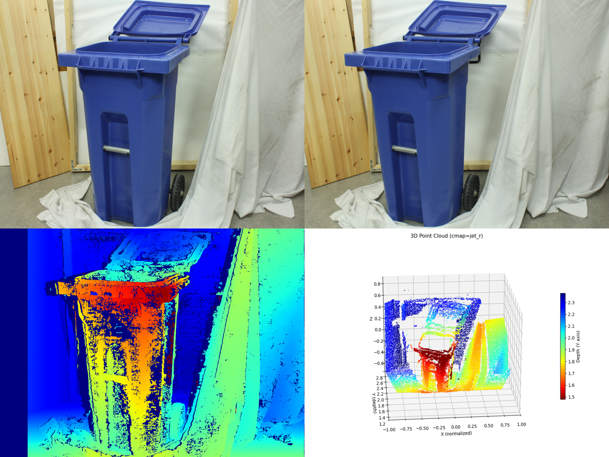
        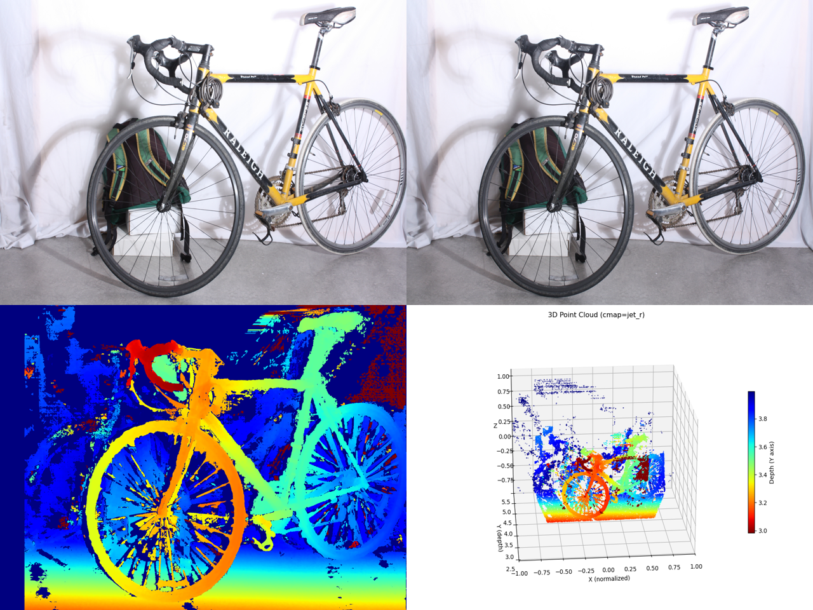
        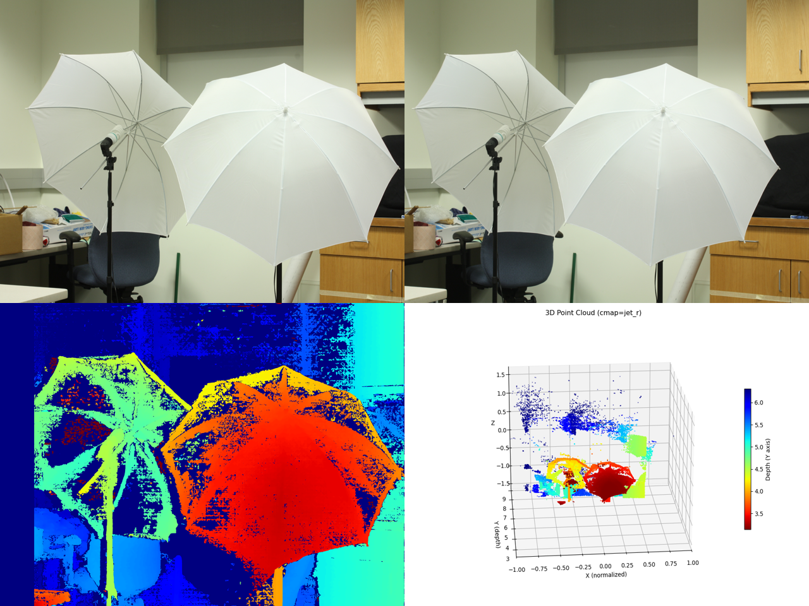
        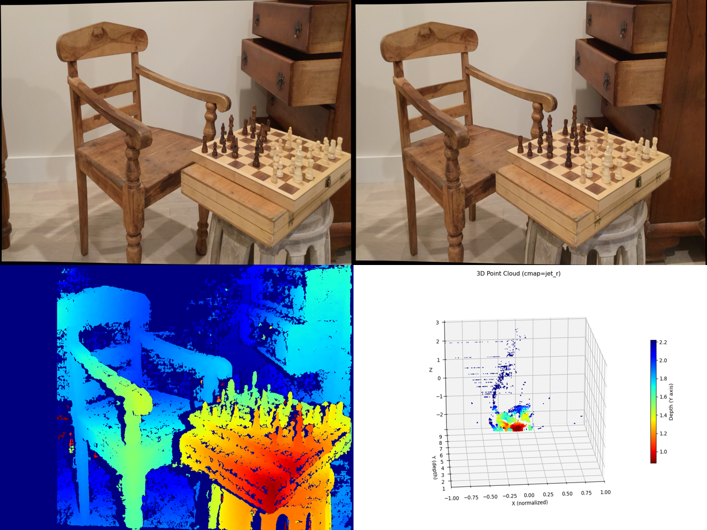
      </a>
       
      <strong><a href="https://github.com/yourusername/project1"> Stereo Depth Estimation</a></strong>
    </td>
  </tr>
  <tr>
    <td align="center">
      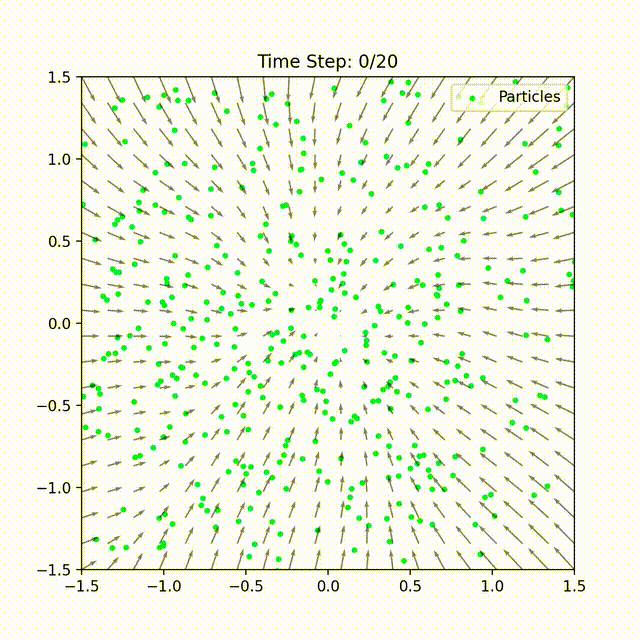 
      <b>Unconditional Flow Matching</b>
    </td>
    <td align="center">
      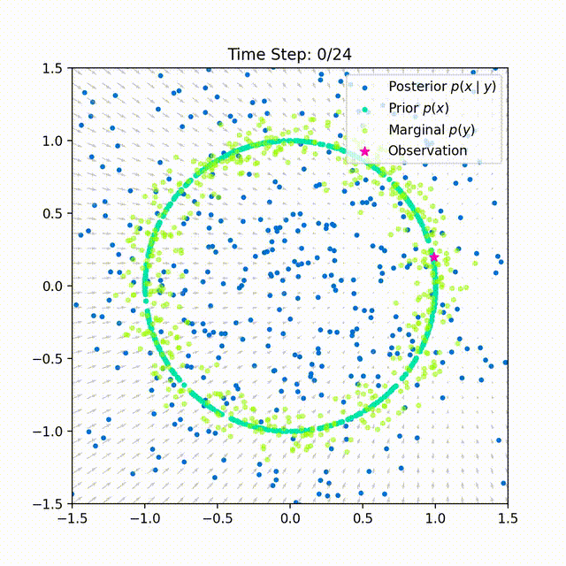 
      <b>Conditional Flow Matching</b>
    </td>
  </tr>
      <td align="center">
      <a href="https://github.com/yourusername/project1">
        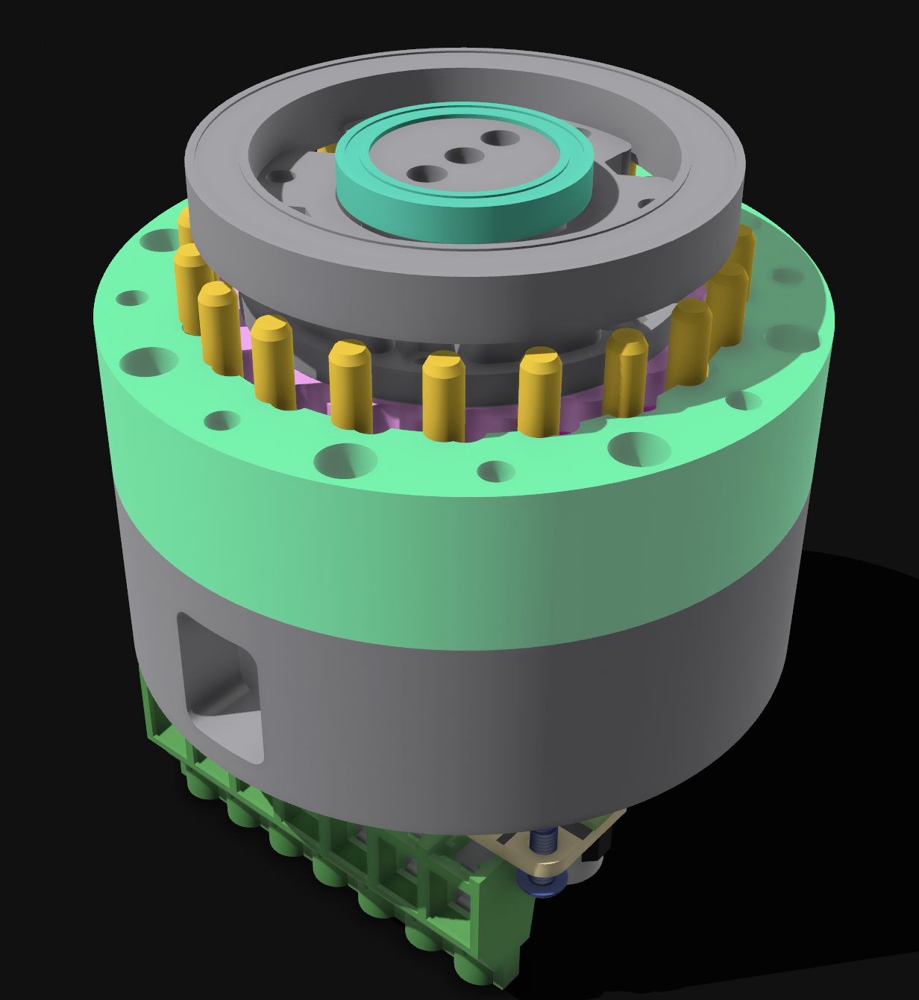
        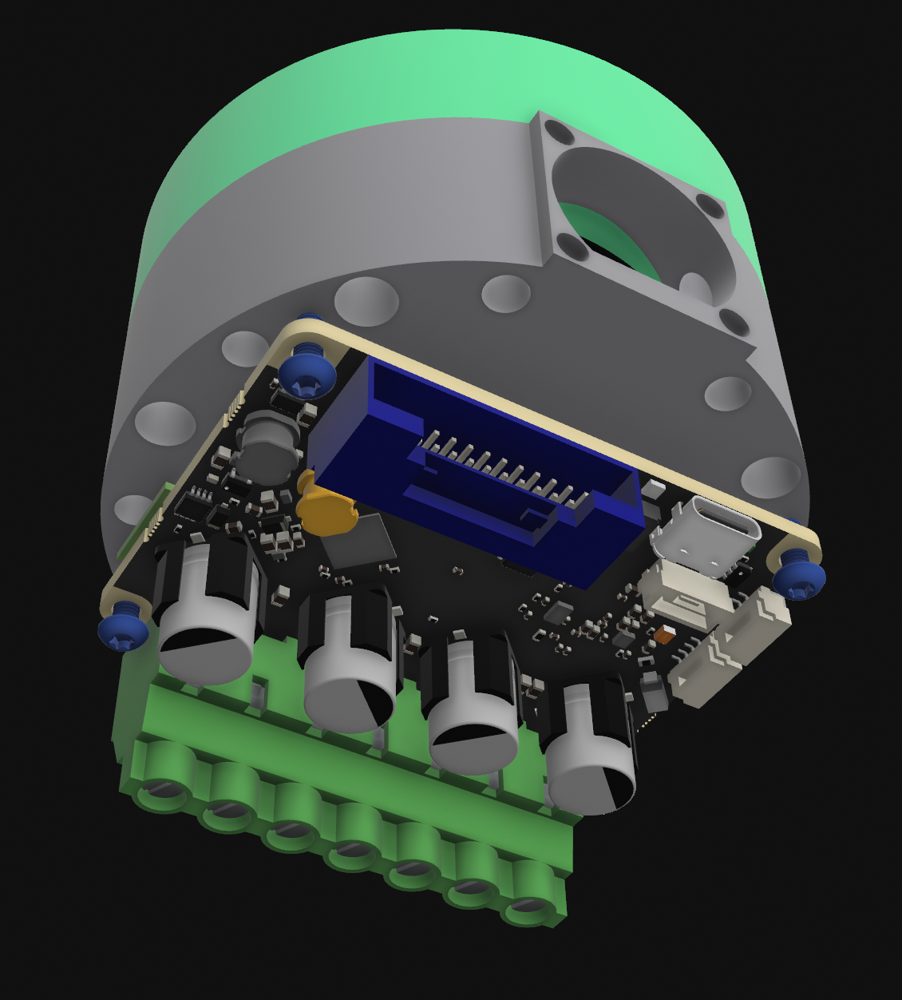
        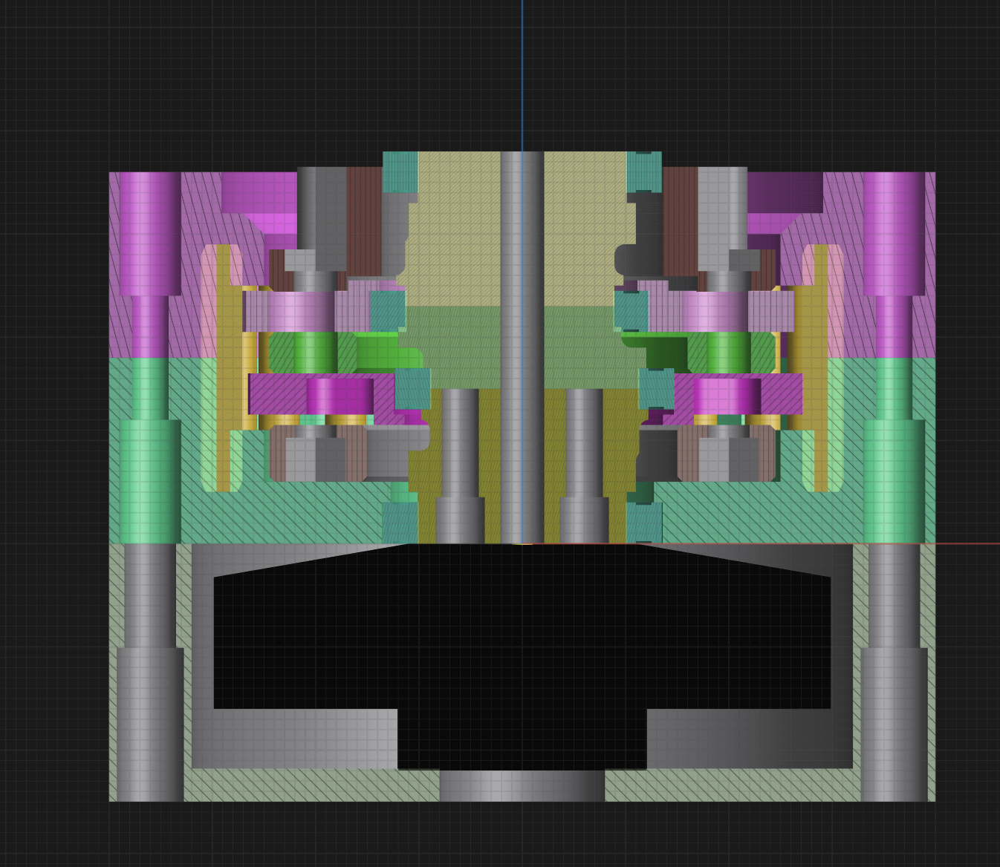
      </a>
       
      <strong><a href="https://github.com/yourusername/project1"> Cycloidal Actuator Design</a></strong>
    </td>
  </tr>
  </tr>
      <td align="center">
      <a href="https://github.com/yourusername/project1">
        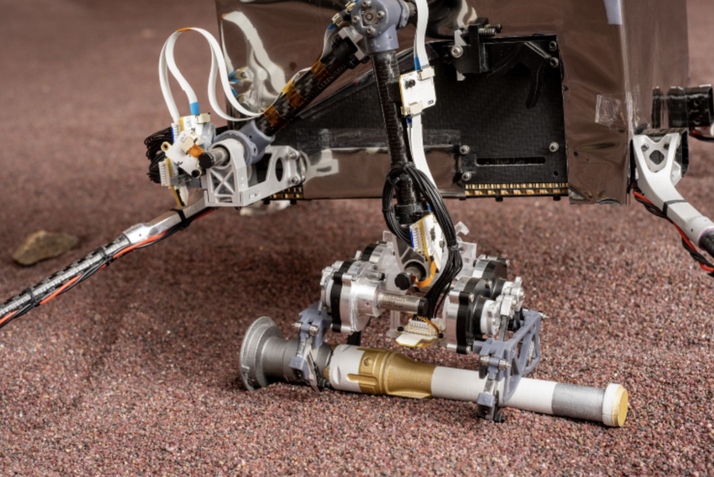
        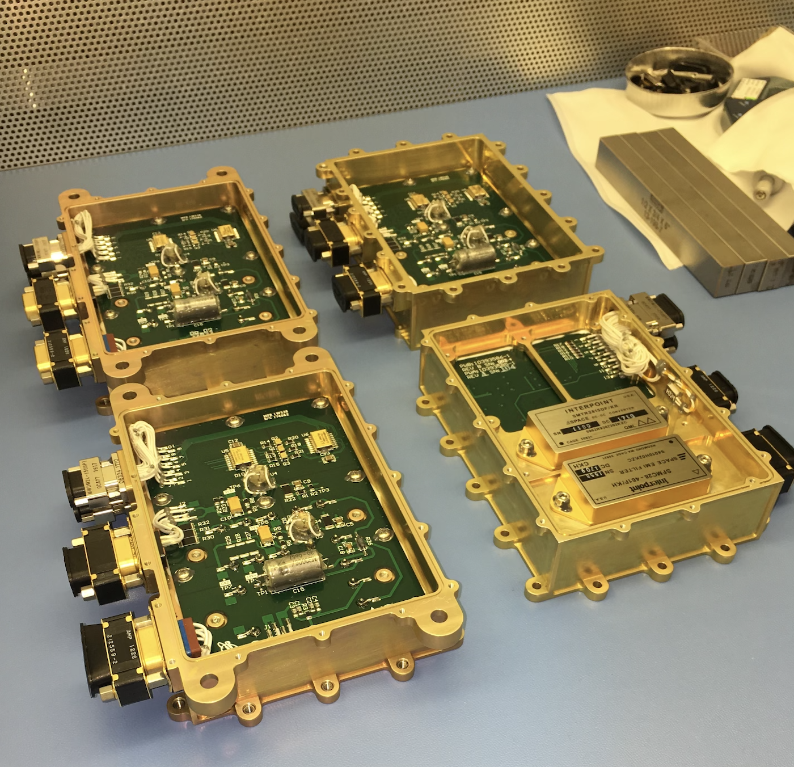
        
        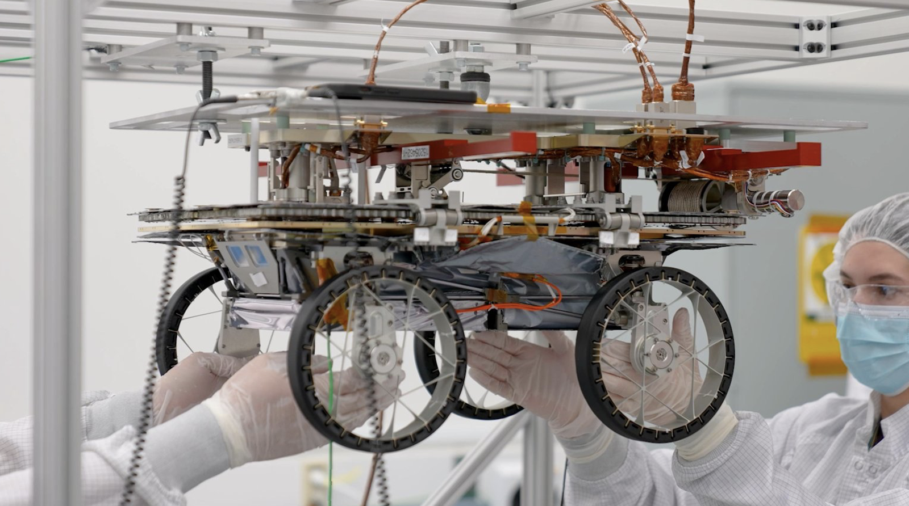
      </a>
       
      <strong><a href="https://github.com/yourusername/project1"> Space Flight Hardware</a></strong>
    </td>
  </tr>
</table>

### 📊 GitHub Stats

 
Clearly, I need to push more often :)

---

## *Thanks for stopping by!*
